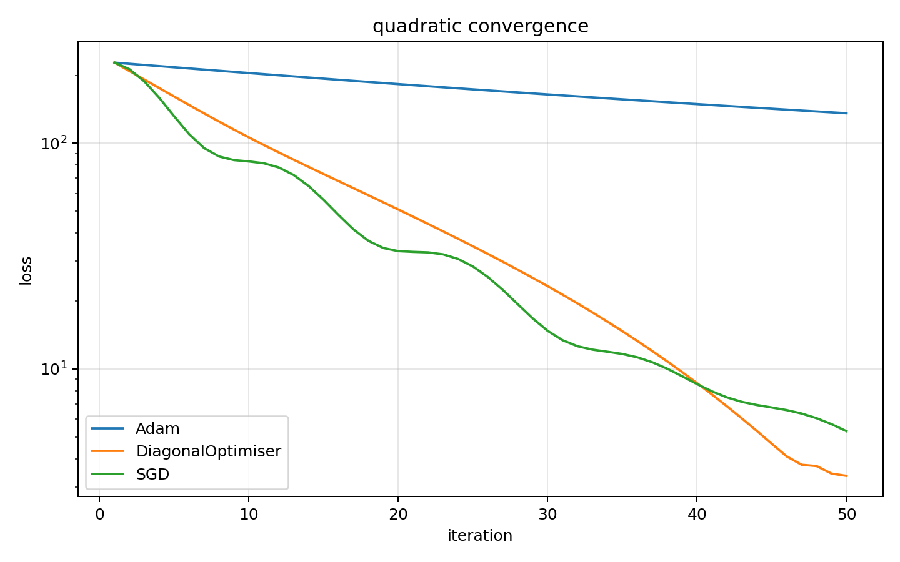
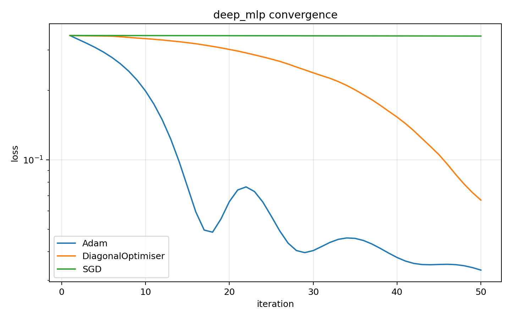
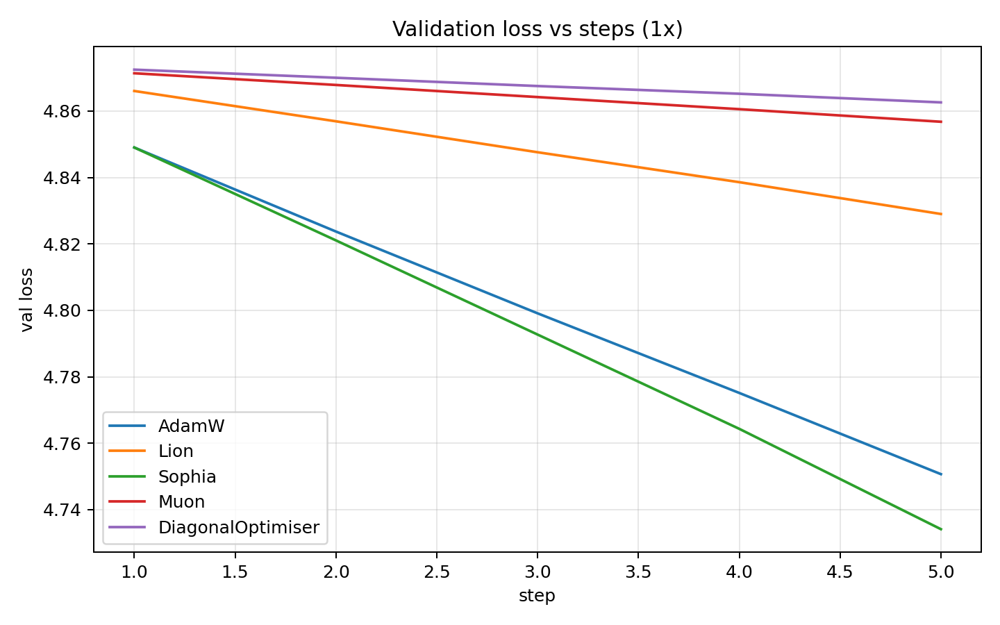
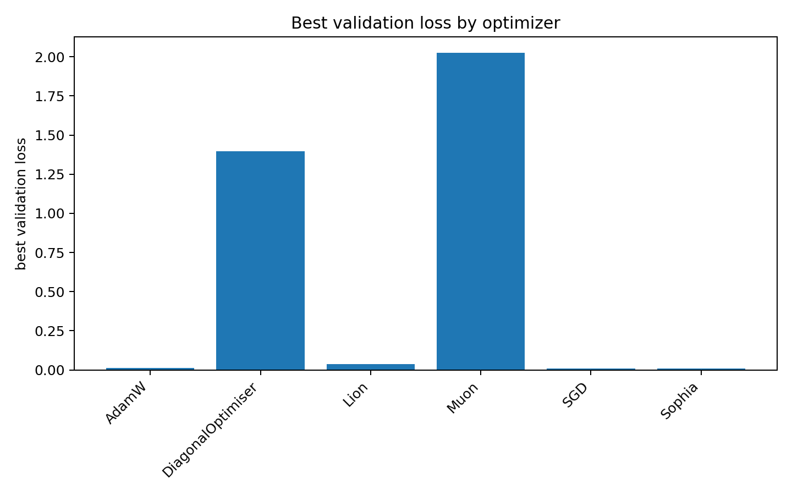

# DiagonalCurvatureOptimizer

The optimizer leverages the fact that performing updates in a diagonalized
curvature basis is significantly cheaper than operating in the full parameter
space. The optimization algorithm combines low-rank curvature estimation, trust
region control, and noise-aware step-size stabilization to improve robustness
under minibatch stochasticity.

Unlike Adam or momentum-based methods, Diagonal((S/A RSVD TR)) explicitly
models local curvature through a rank-k eigenspace approximation of the
Hessian, enabling a computationally efficient Newton-like step in that subspace
while preserving adaptive diagonal scaling elsewhere. It incorporates a
trust-region mechanism based on the ratio of predicted to actual decrease, and
introduces the antisymmetric curvature floor, a technique to prevent step
collapse when Hessian estimates are noisy.

The project focuses on understanding how local curvature structure and
non-symmetric effects influence optimization dynamics, especially on
ill-conditioned and nonconvex objectives.

This is a research-oriented implementation, not a production library.

---

## Core Idea

The proposed optimizer (S/A RSVD TR):

- Approximates curvature using randomized low-rank Hessian sketches
- Separates symmetric (useful curvature) and antisymmetric (noise / instability) components
- Applies noise-aware eigenvalue damping
- Uses a trust-region mechanism with hard step control
- Falls back to gradient steps when curvature information becomes unreliable

The goal is stability and interpretability rather than raw speed.

---

## Original Benchmark Results

The optimizer was initially evaluated against standard baselines on:

- Well-conditioned quadratic objectives


- Ill-conditioned quadratic objectives


- Rosenbrock function


- Binary logistic regression (convex ML task)


These plots are useful historical context for the project. The newer benchmark
suite below is designed to make the same research story more reproducible:
multi-seed runs, saved CSV/JSON metrics, explicit timing, and cleaner notebooks.

---

## Benchmark Philosophy

The final benchmark suite is organized around three research questions.

**RQ1: Does DiagonalOptimiser help on difficult optimization landscapes?**

Use controlled objectives where curvature and conditioning are central:

- ill-conditioned quadratics with condition numbers 10, 100, 1000, 10000
- Rosenbrock-style nonconvex objectives
- optional difficult functions only when they reveal meaningful differences

**RQ2: Does DiagonalOptimiser work on neural network training?**

Use small but real training tasks:

- MLP/CNN on MNIST or FashionMNIST
- TinyGPT on WikiText-2, TinyStories, or a structured built-in text corpus

**RQ3: Is the computational overhead justified?**

Report full cost:

- optimizer step time
- curvature computation time when available
- Hessian-vector product/probe counts
- eigendecomposition/trust-region overhead for the NumPy optimizer path
- total wall-clock training time

The intended claim is deliberately narrow:

> DiagonalOptimiser is a lightweight curvature-aware optimizer designed to
> improve convergence and robustness on difficult optimization problems while
> remaining competitive on neural network training.

This repository should not be read as claiming that DiagonalOptimiser always
beats AdamW or is always faster.

---

## Repository Structure

```text
DiagonalOpti/
├── optimizer/                  # Original NumPy DiagonalOptimiser implementation
├── baselines/                  # NumPy Adam and SGD baselines
├── experiments/
│   ├── difficult_optimization.py
│   └── llm_benchmark/          # TinyGPT benchmark package
├── configs/
│   ├── llm_benchmark.json
│   ├── llm_benchmark_smoke.json
│   └── llm_benchmark_colab_tuned.json
├── notebooks/
│   ├── 01_synthetic_optimization.ipynb
│   ├── 02_neural_network_training.ipynb
│   ├── 03_transformer_training.ipynb
│   └── 04_analysis.ipynb
├── archive/legacy_experiments/ # Original exploratory scripts/notebook
├── paper/
├── results/                    # Generated outputs, not tracked
└── README.md
```

Legacy exploratory experiments are kept under `archive/legacy_experiments/`
for provenance. They are not the final evidence because they are single-seed,
interactive, duplicated, or do not save complete metrics.

---

## Final Notebook Suite

Use these notebooks for publication-facing analysis:

- `notebooks/01_synthetic_optimization.ipynb`
  - ill-conditioned quadratics
  - Rosenbrock/difficult landscape analysis
  - convergence and stability tables

- `notebooks/02_neural_network_training.ipynb`
  - MLP/CNN-style image benchmark
  - MNIST/FashionMNIST support when `torchvision` is available
  - synthetic image smoke fallback for pipeline checks

- `notebooks/03_transformer_training.ipynb`
  - TinyGPT training
  - learning verification
  - throughput, memory, and optimizer overhead tables

- `notebooks/04_analysis.ipynb`
  - combined tables
  - combined interpretation
  - limitations and conclusions

---

## Install

```bash
pip install -r requirements.txt
```

For the MNIST/FashionMNIST notebook, install torchvision too:

```bash
pip install torchvision
```

---

## Reproduce Experiments

Synthetic difficult-landscape benchmark:

```bash
python experiments/difficult_optimization.py --max-iter 500 --seeds 0,1,2,3,4
```

TinyGPT smoke test:

```bash
python -m experiments.llm_benchmark.run --config configs/llm_benchmark_smoke.json
```

TinyGPT full benchmark:

```bash
python -m experiments.llm_benchmark.run --config configs/llm_benchmark.json
```

TinyGPT held-out evaluation using the Colab-tuned learning rates:

```bash
python -m experiments.llm_benchmark.run --config configs/llm_benchmark_colab_tuned.json
```

Smoke results are only pipeline checks; do not use them as scientific evidence.

---

## Hyperparameter Tuning Protocol

Tune before reporting final neural-network or Transformer results, but keep the
procedure fair:

1. Use tuning seeds, for example `0,1`.
2. Sweep a small grid for every optimizer, not only DiagonalOptimiser.
3. Select hyperparameters using validation loss from the tuning runs.
4. Freeze the selected hyperparameters.
5. Report final results on held-out evaluation seeds, for example `2,3,4,5,6`.

TinyGPT learning-rate sweep:

```bash
python -m experiments.llm_benchmark.tune \
  --config configs/llm_benchmark.json \
  --steps 200 \
  --seeds 0,1
```

This writes:

- `results/tuning/llm_benchmark/trials.csv`
- `results/tuning/llm_benchmark/best_by_optimizer.json`
- `results/tuning/llm_benchmark/llm_benchmark_tuned.json`

Use the tuned config for evaluation only after the tuning decision is fixed.
Do not choose the best result from the final evaluation seeds.

---

## What To Show On GitHub

The original plots above are good context for the project. New smoke plots can
also be included as pipeline examples, but label them clearly as smoke tests.
Do not present one-seed or five-step runs as benchmark evidence.

Recommended GitHub figures after full runs:

- synthetic optimization convergence by condition number
- final objective vs condition number with mean +/- std
- TinyGPT validation loss vs steps and wall-clock time
- optimizer overhead table including DiagonalOptimiser curvature/HVP counts

### Current Smoke-Test Outputs

The following plots are generated by the reproducible benchmark code and are
included here as pipeline examples. They are not final paper evidence because
they use smoke settings, short runs, or one seed.

**Synthetic ill-conditioned quadratic smoke test**



**Synthetic deep MLP smoke test**



**TinyGPT smoke test**



**Neural-network smoke test**



### TinyGPT Colab Tuning Snapshot

The following values came from a Colab tuning sweep with tuning seeds `0,1` and
200 tuning steps. These are tuning results, not final held-out evaluation
results.

| Optimizer | Selected LR | Mean Best Val Loss | Mean Final Val Loss |
|---|---:|---:|---:|
| AdamW | 0.001 | 1.5002 | 2.5527 |
| Lion | 0.0003 | 2.0891 | 2.0891 |
| Sophia | 0.0003 | 2.2345 | 2.2896 |
| Muon | 0.0005 | 4.2148 | 4.2148 |
| DiagonalOptimiser | 0.001 | 4.5360 | 4.5360 |

This snapshot suggests TinyGPT is currently more favorable to AdamW under this
tuning budget. DiagonalOptimiser should therefore not be claimed to outperform
AdamW on this Transformer benchmark. The Transformer run is useful for
competitiveness and overhead reporting; the primary curvature story should come
from difficult optimization landscapes.

---

## Outputs

Each benchmark writes CSV/JSON outputs under `results/`.

Common files:

- `metrics.csv`
- `summaries.csv`
- `aggregate.csv`
- `aggregate.json`
- plots under a `plots/` directory

The TinyGPT runner also writes:

- per-run metrics under `results/<experiment>/runs/`
- checkpoints
- `results_table.md`

---

## Metrics

Every final benchmark should report:

- mean +/- standard deviation across at least 5 seeds
- training or objective loss curves
- validation loss curves where applicable
- steps or iterations to target loss
- final and best loss
- wall-clock time
- throughput for neural benchmarks
- memory usage for neural benchmarks
- stability/failure counts
- DiagonalOptimiser curvature/HVP/probe counts where available

---

## Limitations

The original DiagonalOptimiser is a NumPy function optimizer over `f(x)` and
`grad_f(x)`. It is evaluated directly in the synthetic difficult-landscape
benchmarks.

The TinyGPT benchmark uses a PyTorch-compatible diagonal-curvature variant for
model training. Treat it as neural-training evidence for the optimizer idea,
not as a replacement for direct evaluation of the original S/A-RSVD-TR NumPy
algorithm.

Small-scale benchmarks do not prove large-scale optimizer superiority. Report
where DiagonalOptimiser helps, where it is competitive, and where its overhead
is not justified.

---

## Future Work

The optimizer's dominant computational overhead arises from the O(Nk)
Hessian-vector product block required for the spectral curvature sketch.
Reducing this cost is an important direction for improvement.

Possible approaches include structured random sketches, sub-sampled curvature
estimators, and GPU-efficient batching of HVP computations. These may preserve
the quality of the low-rank curvature approximation while lowering per-step
cost.

Scaling the conditioner to larger modern architectures such as Transformers,
CNNs, or diffusion models will require further architectural optimization. In
particular, methods for distributing or decomposing curvature across layers,
rather than forming a single N-dimensional sketch, could improve memory
efficiency and reduce computation. Parallel HVP pipelines or block-diagonal
curvature representations may also help avoid the need for global curvature
sketches when N becomes extremely large.
